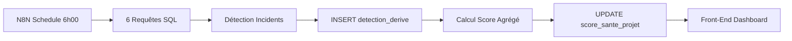

# Système de Détection d'Incidents & Scoring de Projets

**Projet:** Aurentia - Centre de Commande IA pour ESN
**Version:** 1.0 MVP
**Date:** 13 Novembre 2025
**Alignement:** Schéma Supabase réel validé

---

## Table des Matières

1. [Vue d'Ensemble](#vue-densemble)
2. [Architecture du Système](#architecture-du-système)
3. [Les 6 Types d'Incidents](#les-6-types-dincidents)
4. [Système de Scoring](#système-de-scoring)
5. [Migration Optionnelle](#migration-optionnelle)
6. [Workflow N8N](#workflow-n8n)
7. [Affichage Front-End](#affichage-front-end)
8. [Exemples Concrets](#exemples-concrets)
9. [Checklist Déploiement](#checklist-déploiement)

---

## Vue d'Ensemble

### Objectif

Calculer automatiquement un **score de santé (0-100)** pour chaque projet actif, avec détection de 6 types d'incidents critiques permettant d'identifier les projets en difficulté avant qu'il soit trop tard.

### Principe

```
Projets ACTIF → 6 Détections SQL → Incidents stockés → Score calculé → Dashboard War Room
```

### Bénéfices

- ✅ **Détection précoce** des dérives de projets
- ✅ **Objectivité** basée sur données réelles (temps, budget, planning)
- ✅ **Priorisation** automatique pour Direction/PMO
- ✅ **Historique** quotidien pour tendances
- ✅ **Alertes** temps réel si score < 50 (ROUGE)

---

## Architecture du Système

### Tables Supabase Utilisées

| Table | Colonnes Clés | Usage |
|-------|---------------|-------|
| **projet** | `statut`, `date_fin_prevue` | Filtrage projets ACTIF, détection retards |
| **tache** | `charge_estimee_jh`, `statut` ENUM | Calcul heures estimées, détection blocages |
| **temps_passe** | `heures_travaillees` | Calcul heures réelles et coûts |
| **budget_projet** | `montant_total_vente`, `cout_estime_total` | Calcul marges et dépassements |
| **consultant** | `taux_journalier_cout` | Calcul coût réel par heure |
| **incident** | `severite`, `statut` | Comptage incidents critiques |
| **detection_derive** | `type_derive`, `gravite` | Stockage incidents détectés |
| **score_sante_projet** | `score_global`, `couleur_risque` | Historique scores quotidiens |

### Flux de Données



---

## Les 6 Types d'Incidents

### Incident #1 - Dépassement Budget

**Gravité:** CRITIQUE (-25 points)

**Logique:**
- Calculer coût réel = Σ(heures_travaillees × taux_journalier_cout ÷ 7)
- Comparer avec `cout_estime_total`
- Déclencher si coût réel > 120% du coût estimé

**Requête SQL:**

```sql
WITH cout_reel_par_projet AS (
  SELECT
    tp.projet_id,
    SUM(tp.heures_travaillees * c.taux_journalier_cout / 7.0) as cout_reel_calcule
  FROM temps_passe tp
  JOIN consultant c ON tp.consultant_id = c.id
  WHERE tp.organization_id = $1
  GROUP BY tp.projet_id
)
SELECT
  p.id as projet_id,
  p.nom as projet_nom,
  p.organization_id,
  bp.cout_estime_total,
  bp.montant_total_vente,
  crp.cout_reel_calcule as cout_reel,
  ROUND(((crp.cout_reel_calcule / NULLIF(bp.cout_estime_total, 0)) * 100) - 100, 2) as depassement_pct,
  bp.montant_total_vente - crp.cout_reel_calcule as marge_reelle,
  'DEPASSEMENT_BUDGET' as type_derive,
  'CRITIQUE' as gravite
FROM projet p
JOIN budget_projet bp ON p.id = bp.projet_id
JOIN cout_reel_par_projet crp ON p.id = crp.projet_id
WHERE p.statut = 'ACTIF'
  AND p.organization_id = $1
  AND crp.cout_reel_calcule > bp.cout_estime_total * 1.20
ORDER BY depassement_pct DESC;
```

**Données à insérer:**
```sql
INSERT INTO detection_derive (projet_id, organization_id, type_derive, gravite, date_detection)
VALUES ($projet_id, $organization_id, 'DEPASSEMENT_BUDGET', 'CRITIQUE', NOW());
```

---

### Incident #2 - Retard Planning

**Gravité:** MAJEUR (-15 points)

**Logique:**
- Projets avec `date_fin_prevue < CURRENT_DATE`
- Seuil: >30 jours de retard
- Statut: ACTIF uniquement

**Requête SQL:**

```sql
SELECT
  p.id as projet_id,
  p.nom as projet_nom,
  p.organization_id,
  p.date_fin_prevue,
  p.date_debut,
  EXTRACT(DAY FROM (CURRENT_DATE - p.date_fin_prevue)) as jours_retard,
  'RETARD_PLANNING' as type_derive,
  'MAJEUR' as gravite
FROM projet p
WHERE p.statut = 'ACTIF'
  AND p.organization_id = $1
  AND p.date_fin_prevue < CURRENT_DATE
  AND EXTRACT(DAY FROM (CURRENT_DATE - p.date_fin_prevue)) > 30
ORDER BY jours_retard DESC;
```

---

### Incident #3 - Explosion Heures

**Gravité:** CRITIQUE (-25 points)

**Logique:**
- Convertir `charge_estimee_jh` (jours-homme) en heures: × 7
- Comparer avec Σ`heures_travaillees` réelles
- Déclencher si heures réelles > 150% estimées

**Requête SQL:**

```sql
WITH heures_par_projet AS (
  SELECT
    t.projet_id,
    SUM(t.charge_estimee_jh * 7.0) as heures_estimees,
    SUM(tp.heures_travaillees) as heures_reelles
  FROM tache t
  LEFT JOIN temps_passe tp ON t.id = tp.tache_id
  WHERE t.organization_id = $1
    AND t.charge_estimee_jh IS NOT NULL
  GROUP BY t.projet_id
  HAVING SUM(t.charge_estimee_jh * 7.0) > 0
)
SELECT
  p.id as projet_id,
  p.nom as projet_nom,
  p.organization_id,
  hpp.heures_estimees,
  hpp.heures_reelles,
  ROUND(((hpp.heures_reelles / NULLIF(hpp.heures_estimees, 0)) * 100) - 100, 2) as depassement_pct,
  'EXPLOSION_HEURES' as type_derive,
  'CRITIQUE' as gravite
FROM projet p
JOIN heures_par_projet hpp ON p.id = hpp.projet_id
WHERE p.statut = 'ACTIF'
  AND p.organization_id = $1
  AND hpp.heures_reelles > hpp.heures_estimees * 1.5
ORDER BY depassement_pct DESC;
```

---

### Incident #4 - Tâches Bloquées

**Gravité:** MOYEN (-2 points par tâche)

**Logique:**
- Tâches avec `statut = 'BLOCKED'` (ENUM)
- Bloquées depuis >7 jours (via `updated_at`)
- Cumul: 4 tâches = -8 points

**Requête SQL:**

```sql
SELECT
  t.projet_id,
  p.nom as projet_nom,
  p.organization_id,
  COUNT(*) as nb_taches_bloquees,
  ARRAY_AGG(t.nom) as taches_noms,
  ARRAY_AGG(EXTRACT(DAY FROM (NOW() - t.updated_at))::INTEGER) as jours_blocage,
  'TACHES_BLOQUEES' as type_derive,
  'MOYEN' as gravite
FROM tache t
JOIN projet p ON t.projet_id = p.id
WHERE t.statut = 'BLOCKED'
  AND t.organization_id = $1
  AND EXTRACT(DAY FROM (NOW() - t.updated_at)) > 7
  AND p.statut = 'ACTIF'
GROUP BY t.projet_id, p.nom, p.organization_id
ORDER BY nb_taches_bloquees DESC;
```

---

### Incident #5 - Incidents Critiques Ouverts

**Gravité:** MOYEN (-5 points par incident)

**Logique:**
- Incidents avec `severite = 'CRITIQUE'` (text field)
- Statut ouvert (pas RESOLU/FERME/CLOS)
- Cumul: 2 incidents = -10 points

**Requête SQL:**

```sql
SELECT
  i.projet_id,
  p.nom as projet_nom,
  p.organization_id,
  COUNT(*) as nb_incidents_critiques,
  ARRAY_AGG(i.titre) as incidents_titres,
  ARRAY_AGG(EXTRACT(DAY FROM (NOW() - i.date_ouverture))::INTEGER) as jours_ouverture,
  'INCIDENTS_CRITIQUES' as type_derive,
  'MOYEN' as gravite
FROM incident i
JOIN projet p ON i.projet_id = p.id
WHERE i.severite = 'CRITIQUE'
  AND i.organization_id = $1
  AND i.statut NOT IN ('RESOLU', 'FERME', 'CLOS')
  AND p.statut = 'ACTIF'
GROUP BY i.projet_id, p.nom, p.organization_id
ORDER BY nb_incidents_critiques DESC;
```

---

### Incident #6 - Marge Faible

**Gravité:** MAJEUR (-15 points)

**Logique:**
- Calculer marge % = (montant_total_vente - cout_reel) / montant_total_vente × 100
- Déclencher si marge < 10%
- Objectif ESN: 15-25% de marge

**Requête SQL:**

```sql
WITH cout_reel_par_projet AS (
  SELECT
    tp.projet_id,
    SUM(tp.heures_travaillees * c.taux_journalier_cout / 7.0) as cout_reel_calcule
  FROM temps_passe tp
  JOIN consultant c ON tp.consultant_id = c.id
  WHERE tp.organization_id = $1
  GROUP BY tp.projet_id
)
SELECT
  p.id as projet_id,
  p.nom as projet_nom,
  p.organization_id,
  bp.montant_total_vente,
  crp.cout_reel_calcule as cout_reel,
  bp.montant_total_vente - crp.cout_reel_calcule as marge_reelle,
  ROUND(((bp.montant_total_vente - crp.cout_reel_calcule) / NULLIF(bp.montant_total_vente, 0)) * 100, 2) as marge_pct,
  bp.marge_cible_pct,
  'MARGE_FAIBLE' as type_derive,
  'MAJEUR' as gravite
FROM projet p
JOIN budget_projet bp ON p.id = bp.projet_id
JOIN cout_reel_par_projet crp ON p.id = crp.projet_id
WHERE p.statut = 'ACTIF'
  AND p.organization_id = $1
  AND ((bp.montant_total_vente - crp.cout_reel_calcule) / NULLIF(bp.montant_total_vente, 0)) < 0.10
ORDER BY marge_pct ASC;
```

---

## Système de Scoring

### Mapping Gravité → Points

| Gravité | Points Retirés | Cas d'Usage |
|---------|----------------|-------------|
| **CRITIQUE** | -25 points | Dépassement budget, Explosion heures |
| **MAJEUR** | -15 points | Retard planning, Marge faible |
| **MOYEN** | -2 à -8 points | Tâches bloquées (×2), Incidents critiques (×5) |
| **MINEUR** | -3 points | (Réservé pour évolutions futures) |

### Formule de Calcul

```
Score_Global = MAX(0, 100 - Σ Pénalités)

Avec:
- Score minimum: 0/100
- Score maximum: 100/100
```

### Couleur de Risque

```
Score >= 80  → VERT   (Projet sain)
Score 50-79  → ORANGE (Vigilance requise)
Score < 50   → ROUGE  (Intervention urgente)
```

### Requête Calcul Score Agrégé

```sql
WITH penalites AS (
  SELECT
    projet_id,
    SUM(
      CASE gravite
        WHEN 'CRITIQUE' THEN 25
        WHEN 'MAJEUR' THEN 15
        WHEN 'MOYEN' THEN
          CASE
            WHEN type_derive = 'TACHES_BLOQUEES' THEN 2
            WHEN type_derive = 'INCIDENTS_CRITIQUES' THEN 5
            ELSE 8
          END
        WHEN 'MINEUR' THEN 3
        ELSE 0
      END
    ) as total_penalites
  FROM detection_derive
  WHERE date_detection::DATE = CURRENT_DATE
    AND organization_id = $1
  GROUP BY projet_id
)
SELECT
  p.id,
  p.nom,
  COALESCE(pen.total_penalites, 0) as penalites,
  GREATEST(0, 100 - COALESCE(pen.total_penalites, 0)) as score_global,
  CASE
    WHEN GREATEST(0, 100 - COALESCE(pen.total_penalites, 0)) >= 80 THEN 'VERT'
    WHEN GREATEST(0, 100 - COALESCE(pen.total_penalites, 0)) >= 50 THEN 'ORANGE'
    ELSE 'ROUGE'
  END as couleur_risque
FROM projet p
LEFT JOIN penalites pen ON p.id = pen.projet_id
WHERE p.statut = 'ACTIF'
  AND p.organization_id = $1;
```

---

## Migration Optionnelle

### Enrichissement table `detection_derive`

**Objectif:** Améliorer l'UX sans bloquer le MVP

**Colonnes à ajouter:**

```sql
-- Migration optionnelle (non bloquante pour MVP)
ALTER TABLE detection_derive
ADD COLUMN IF NOT EXISTS description TEXT,
ADD COLUMN IF NOT EXISTS metriques JSONB DEFAULT '{}',
ADD COLUMN IF NOT EXISTS score_impact INTEGER DEFAULT 0,
ADD COLUMN IF NOT EXISTS statut TEXT DEFAULT 'ACTIF';

-- Index pour performance
CREATE INDEX IF NOT EXISTS idx_detection_derive_statut
  ON detection_derive(statut, projet_id)
  WHERE statut = 'ACTIF';

-- Commentaires
COMMENT ON COLUMN detection_derive.description IS 'Description textuelle de l''incident pour affichage front-end';
COMMENT ON COLUMN detection_derive.metriques IS 'Données chiffrées JSON (budget dépassé, jours retard, etc.)';
COMMENT ON COLUMN detection_derive.score_impact IS 'Points retirés au score global (transparence)';
COMMENT ON COLUMN detection_derive.statut IS 'ACTIF | RESOLU | IGNORE';
```

### Bénéfices de la Migration

**Avant (schéma actuel):**
```
type_derive: "DEPASSEMENT_BUDGET"
gravite: "CRITIQUE"
```

**Après (schéma enrichi):**
```
type_derive: "DEPASSEMENT_BUDGET"
gravite: "CRITIQUE"
description: "Budget dépassé de 35% (81 000€ au lieu de 60 000€)"
metriques: {
  "budget_alloue": 60000,
  "cout_reel": 81000,
  "depassement_pct": 35,
  "marge_reelle": -21000
}
score_impact: 25
statut: "ACTIF"
```

### Insertion Enrichie

```sql
INSERT INTO detection_derive (
  projet_id,
  organization_id,
  type_derive,
  gravite,
  description,
  metriques,
  score_impact,
  statut,
  date_detection
) VALUES (
  $1,
  $2,
  'DEPASSEMENT_BUDGET',
  'CRITIQUE',
  'Budget dépassé de ' || $depassement_pct || '% (' || $cout_reel || '€ vs ' || $budget || '€)',
  jsonb_build_object(
    'budget_alloue', $budget,
    'cout_reel', $cout_reel,
    'depassement_pct', $depassement_pct,
    'marge_reelle', $marge_reelle
  ),
  25,
  'ACTIF',
  NOW()
);
```

---

## Workflow N8N

### Vue d'Ensemble

```
[Schedule 6h00]
    ↓
[Nettoyage optionnel]
    ↓
[Boucle: 6 Requêtes SQL] ──┐
    ↓                       │
[INSERT detection_derive]   │ Pour chaque
    ↓                       │ incident
[Fin boucle] ───────────────┘ détecté
    ↓
[Calcul scores agrégés]
    ↓
[INSERT/UPDATE score_sante_projet]
    ↓
[Alertes optionnelles si ROUGE]
```

### Étapes Détaillées

#### 1. Trigger Schedule

```json
{
  "cron": "0 6 * * *",
  "timezone": "Europe/Paris"
}
```

#### 2. Nettoyage (Optionnel)

```sql
-- Supprimer détections du jour précédent
DELETE FROM detection_derive
WHERE date_detection::DATE < CURRENT_DATE
  AND organization_id = $organization_id;
```

#### 3. Exécution des 6 Requêtes

Pour chaque incident détecté, créer une entrée `detection_derive`:

```javascript
// Node: Function - Process Incidents
const incidents = [];

// Incident #1 - Dépassement Budget
const budgetResults = $input.item.json.budget_incidents;
budgetResults.forEach(row => {
  incidents.push({
    projet_id: row.projet_id,
    organization_id: row.organization_id,
    type_derive: 'DEPASSEMENT_BUDGET',
    gravite: 'CRITIQUE',
    date_detection: new Date()
  });
});

// ... Répéter pour les 5 autres types

return incidents.map(inc => ({ json: inc }));
```

#### 4. Insertion Batch

```sql
-- Node: Postgres - Bulk Insert
INSERT INTO detection_derive (
  projet_id,
  organization_id,
  type_derive,
  gravite,
  date_detection
)
SELECT
  (incident->>'projet_id')::UUID,
  (incident->>'organization_id')::UUID,
  incident->>'type_derive',
  incident->>'gravite',
  NOW()
FROM json_array_elements($incidents::JSON) AS incident;
```

#### 5. Calcul Scores

Utiliser la requête SQL d'agrégation (voir section Système de Scoring)

#### 6. Update Scores

```sql
-- Node: Postgres - Update Scores
INSERT INTO score_sante_projet (
  projet_id,
  organization_id,
  score_global,
  couleur_risque,
  date_analyse,
  raisonnement_ia
)
SELECT
  id,
  organization_id,
  score_global,
  couleur_risque,
  CURRENT_DATE,
  'Analyse automatique quotidienne - ' || total_penalites || ' points de pénalités détectés'
FROM $scores
ON CONFLICT (projet_id, date_analyse)
DO UPDATE SET
  score_global = EXCLUDED.score_global,
  couleur_risque = EXCLUDED.couleur_risque,
  raisonnement_ia = EXCLUDED.raisonnement_ia,
  updated_at = NOW();
```

#### 7. Alertes (Optionnel)

```javascript
// Node: Filter - Only RED projects
return $input.item.json.couleur_risque === 'ROUGE';

// Node: Send Notification
// Email, Slack, ou notification in-app pour projets ROUGE
```

---

## Affichage Front-End

### Dashboard War Room

**Objectif:** Vue d'ensemble de tous les projets actifs

**Requête TypeScript:**

```typescript
// Récupérer projets avec leur dernier score
const { data: projets } = await supabase
  .from('projet')
  .select(`
    id,
    nom,
    statut,
    score_sante_projet!inner (
      score_global,
      couleur_risque,
      date_analyse
    )
  `)
  .eq('statut', 'ACTIF')
  .eq('organization_id', currentOrgId)
  .order('score_sante_projet(score_global)', { ascending: true });

// Récupérer incidents du jour
const { data: incidentsJour } = await supabase
  .from('detection_derive')
  .select('*')
  .eq('organization_id', currentOrgId)
  .gte('date_detection', new Date().toISOString().split('T')[0])
  .order('gravite', { ascending: false });
```

**Composant React:**

```tsx
interface ProjetCardProps {
  projet: {
    nom: string;
    score_global: number;
    couleur_risque: 'VERT' | 'ORANGE' | 'ROUGE';
  };
  incidents: Array<{
    type_derive: string;
    gravite: string;
  }>;
}

const ProjetCard = ({ projet, incidents }: ProjetCardProps) => {
  const getBadgeColor = (couleur: string) => {
    const colors = {
      'VERT': 'bg-green-100 text-green-800 border-green-500',
      'ORANGE': 'bg-orange-100 text-orange-800 border-orange-500',
      'ROUGE': 'bg-red-100 text-red-800 border-red-500'
    };
    return colors[couleur] || colors.VERT;
  };

  const getScoreImpact = (gravite: string, type?: string) => {
    if (gravite === 'CRITIQUE') return 25;
    if (gravite === 'MAJEUR') return 15;
    if (gravite === 'MOYEN') {
      if (type === 'TACHES_BLOQUEES') return 2;
      if (type === 'INCIDENTS_CRITIQUES') return 5;
      return 8;
    }
    return 3;
  };

  return (
    <Card className={`border-l-4 ${getBadgeColor(projet.couleur_risque)}`}>
      <div className="flex justify-between items-start mb-4">
        <h3 className="text-lg font-semibold">{projet.nom}</h3>
        <Badge className={getBadgeColor(projet.couleur_risque)}>
          {projet.couleur_risque}
        </Badge>
      </div>

      <div className="text-4xl font-bold my-4 text-center">
        {projet.score_global}/100
      </div>

      <div className="space-y-2">
        {incidents.slice(0, 3).map((inc, i) => (
          <Alert key={i} variant={inc.gravite === 'CRITIQUE' ? 'destructive' : 'default'}>
            <span>{INCIDENT_LABELS[inc.type_derive]}</span>
            <span className="font-bold ml-2">
              -{getScoreImpact(inc.gravite, inc.type_derive)} pts
            </span>
          </Alert>
        ))}
        {incidents.length > 3 && (
          <p className="text-sm text-muted-foreground">
            + {incidents.length - 3} autres incidents
          </p>
        )}
      </div>
    </Card>
  );
};

// Labels d'affichage
const INCIDENT_LABELS = {
  'DEPASSEMENT_BUDGET': '💸 Dépassement budget',
  'RETARD_PLANNING': '⏰ Retard planning',
  'EXPLOSION_HEURES': '📈 Explosion heures',
  'TACHES_BLOQUEES': '🚧 Tâches bloquées',
  'INCIDENTS_CRITIQUES': '⚠️ Incidents critiques',
  'MARGE_FAIBLE': '📉 Marge faible'
};
```

### Page Détail Projet

**Requêtes:**

```typescript
// Historique scores (30 derniers jours)
const { data: historique } = await supabase
  .from('score_sante_projet')
  .select('score_global, couleur_risque, date_analyse')
  .eq('projet_id', projetId)
  .gte('date_analyse', thirtyDaysAgo)
  .order('date_analyse', { ascending: true });

// Incidents actifs
const { data: incidents } = await supabase
  .from('detection_derive')
  .select('*')
  .eq('projet_id', projetId)
  .gte('date_detection', sevenDaysAgo)
  .order('date_detection', { ascending: false });

// Grouper par type
const incidentsParType = incidents.reduce((acc, inc) => {
  acc[inc.type_derive] = (acc[inc.type_derive] || 0) + 1;
  return acc;
}, {});
```

**Graphique Tendance:**

```tsx
import { LineChart, Line, XAxis, YAxis, Tooltip } from 'recharts';

const TendanceScore = ({ historique }) => (
  <LineChart width={600} height={300} data={historique}>
    <XAxis dataKey="date_analyse" />
    <YAxis domain={[0, 100]} />
    <Tooltip />
    <Line
      type="monotone"
      dataKey="score_global"
      stroke="#8884d8"
      strokeWidth={2}
    />
  </LineChart>
);
```

---

## Exemples Concrets

### Exemple 1 - Projet en Difficulté Majeure

**Projet:** Migration ERP Client Luxe
**Date:** 13 Novembre 2025

**État Initial:**
- Budget estimé: 80 000€
- Montant vente: 120 000€
- Marge cible: 25%
- Date fin prévue: 30/10/2025
- Heures estimées: 840h (120 jours-homme)

**État Réel:**
- Coût réel: 108 000€ (dépassement +35%)
- Heures réelles: 1 260h (dépassement +50%)
- Date actuelle: 13/11/2025 (14 jours de retard)
- 2 tâches bloquées depuis 9 jours
- 1 incident critique ouvert
- Marge réelle: 10%

**Détections Automatiques:**

| Type Incident | Déclenché | Gravité | Points |
|---------------|-----------|---------|--------|
| Dépassement Budget | ✅ (+35%) | CRITIQUE | -25 |
| Retard Planning | ❌ (14j < 30j) | - | 0 |
| Explosion Heures | ✅ (+50%) | CRITIQUE | -25 |
| Tâches Bloquées | ✅ (2 tâches) | MOYEN | -4 |
| Incidents Critiques | ✅ (1 incident) | MOYEN | -5 |
| Marge Faible | ❌ (10% = seuil) | - | 0 |

**Score Final:** 100 - (25 + 25 + 4 + 5) = **41/100** 🔴 **ROUGE**

**Affichage Dashboard:**

```
┌──────────────────────────────────┐
│ Migration ERP Client Luxe        │
│                         🔴 ROUGE │
│                                  │
│           41/100                 │
│                                  │
│ 💸 Dépassement budget +35% -25pts│
│ 📈 Explosion heures +50%   -25pts│
│ 🚧 2 tâches bloquées       -4pts │
│ ⚠️ 1 incident critique     -5pts │
│                                  │
│ ⚠️ INTERVENTION URGENTE REQUISE │
└──────────────────────────────────┘
```

**Actions Recommandées:**
1. Comité de crise immédiat
2. Gel du périmètre (stop scope creep)
3. Déblocage tâches prioritaires
4. Renfort équipe ou réduction périmètre

---

### Exemple 2 - Projet en Vigilance

**Projet:** Refonte Site E-Commerce
**Score:** **63/100** 🟠 **ORANGE**

**Incidents détectés:**
- Retard planning: 35 jours (-15 pts)
- 3 tâches bloquées (-6 pts)
- 2 incidents critiques (-10 pts)
- Marge: 12% (limite mais acceptable)

**Actions Recommandées:**
1. Point hebdomadaire renforcé
2. Déblocage des tâches
3. Monitoring marge étroit

---

### Exemple 3 - Projet Sain

**Projet:** App Mobile Gestion RH
**Score:** **92/100** 🟢 **VERT**

**Incidents détectés:**
- 1 tâche bloquée 8 jours (-2 pts)
- Budget: 95% consommé (dans les clous)
- Planning: avance de 5 jours

**Actions Recommandées:**
- Continuer monitoring standard
- Débloquer tâche mineure

---

## Checklist Déploiement

### Prérequis Techniques

- [ ] Supabase configuré avec tables existantes validées
- [ ] N8N installé et accessible
- [ ] Connexion N8N ↔ Supabase fonctionnelle (API URL + Service Role Key)
- [ ] Variables d'environnement:
  - `ORGANIZATION_ID` (pour multi-tenant)
  - `SUPABASE_URL`
  - `SUPABASE_SERVICE_ROLE_KEY`

### Configuration N8N

- [ ] Workflow créé avec Schedule Trigger (6h00 quotidien)
- [ ] 6 nodes PostgreSQL pour requêtes de détection
- [ ] Node Function pour transformation des données
- [ ] Node PostgreSQL pour insertion batch `detection_derive`
- [ ] Node PostgreSQL pour calcul scores agrégés
- [ ] Node PostgreSQL pour update `score_sante_projet`
- [ ] (Optionnel) Node Email/Slack pour alertes ROUGE

### Tests

- [ ] Test unitaire: chaque requête SQL retourne des résultats
- [ ] Test insertion: `detection_derive` contient les incidents
- [ ] Test calcul: `score_sante_projet` contient les scores corrects
- [ ] Test couleurs: VERT (≥80), ORANGE (50-79), ROUGE (<50)
- [ ] Test multi-tenant: filtrage `organization_id` fonctionne

### Front-End

- [ ] Dashboard War Room affiche liste projets avec scores
- [ ] Cards projets colorées selon risque (vert/orange/rouge)
- [ ] Click sur projet → page détail
- [ ] Page détail affiche incidents actifs
- [ ] Graphique tendance score sur 30 jours

### Migration Optionnelle

- [ ] (Nice-to-have) Migration `detection_derive` exécutée
- [ ] (Nice-to-have) Insertion enrichie avec description/metriques
- [ ] (Nice-to-have) Affichage détails incidents amélioré

### Documentation

- [ ] Ce document partagé avec équipe technique
- [ ] Formation N8N pour maintenance workflow
- [ ] Procédure intervention si projet ROUGE

### Go-Live

- [ ] Exécution manuelle workflow N8N pour test
- [ ] Vérification données dans Supabase
- [ ] Activation schedule automatique
- [ ] Monitoring logs N8N pendant 3 jours
- [ ] Validation scores par PMO/Direction

---

## Évolutions Futures

### Phase 2 - Incidents Supplémentaires

1. **Consultants Surchargés**
   - Détection: >45h/semaine pendant 3+ semaines
   - Gravité: MOYEN (-8 pts)

2. **Vélocité en Baisse**
   - Détection: vélocité actuelle < 70% moyenne 3 mois
   - Gravité: MAJEUR (-15 pts)

3. **Turnover Équipe**
   - Détection: >30% départs sur 6 mois
   - Gravité: CRITIQUE (-25 pts)

### Phase 3 - Scoring Pondéré par Dimension

Au lieu de simple soustraction, pondérer par les 5 dimensions:

```
Score = Σ (Score_Dimension × Poids_Dimension)

Avec:
- Planning (25%): incidents #2
- Charge (20%): incidents #3
- Incidents (20%): incidents #5
- Budget/Marge (25%): incidents #1, #6
- Équipe (10%): incidents #4, turnover futur
```

### Phase 4 - IA Prédictive

- Prédiction score J+7, J+15, J+30
- Recommandations automatiques d'actions
- Simulation impact actions sur score

---

## Support & Maintenance

### Contact

- **Documentation:** Ce fichier (SYSTEME_DETECTION_INCIDENTS_SCORING.md)
- **Équipe Technique:** DevOps Aurentia
- **Support N8N:** [Documentation N8N](https://docs.n8n.io)
- **Support Supabase:** [Documentation Supabase](https://supabase.com/docs)

### Logs & Debugging

**N8N:**
- Logs dans interface N8N → Executions
- Filtrer par workflow "Détection Incidents Projets"
- Vérifier erreurs SQL

**Supabase:**
- Logs SQL dans Dashboard Supabase → SQL Editor
- Table `detection_derive` pour voir incidents détectés
- Table `score_sante_projet` pour historique scores

### Performance

- **Requêtes SQL:** Optimisées avec CTE et index existants
- **Temps exécution:** ~30-60 secondes pour 100 projets actifs
- **Fréquence:** 1×/jour à 6h00 (charge faible)

---

**Fin du Document**

Version 1.0 MVP - Prêt pour déploiement 🚀
